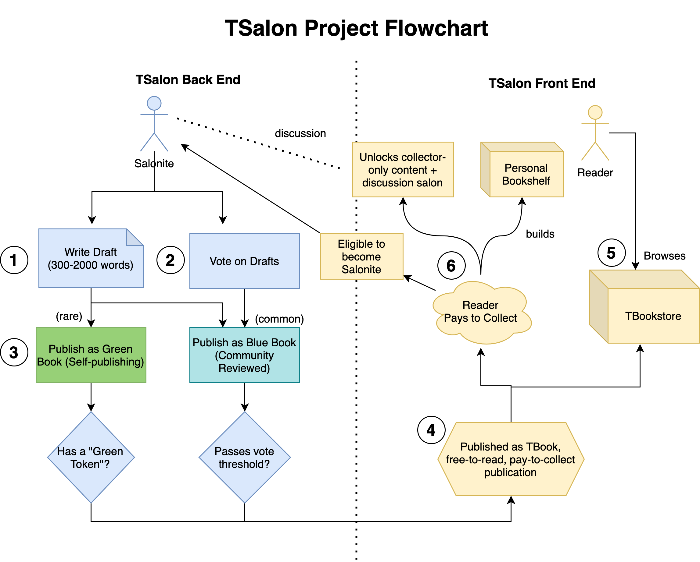

# TSalon Publishing House
*A DAO-Governed Web3 Publishing House*

🔗 [tsalon.io](https://tsalon.io)

👨‍🎨 [fishylosopher.eth](https://jayyu.xyz)

**December 2022 Update**: Following the Ethereum Merge and subsequent deprecation of the Rinkeby Testnet, the deployed TSalon DApp prototype is no longer maintained. The TSalon framework and codebase will continue to be open-source and available for all to use and modify.

## Overview

TSalon is a web3 publishing house, conceptualizing an NFT-based publishing and collection platform to create a vision of a digital publishing platform that decentralizes writing, earning, and ownership of writing back to the authors.

Each piece of writing is presented as a free-to-read, pay-to-collect NFT in the TBookstore. Collecting NFTs in the TBookstore allows readers to build up their own bookshelf and become voting members of the TSalon DAO, decides the publication of new articles on the bookstore. Readers that collect NFTs of a work also gain rights of distribution of secondary co-creation, such as through spinoff fanfiction and worldbuilding.

Many thanks to our friends at [Stanford Rewired Magazine](https://stanfordrewired.com/), [ZFellows](https://www.zfellows.com/) and the [Neo Scholar Program](https://neo.com/scholars) for their continued support of TSalon.

## Design Litepaper
*Updated June 2022*

Below is a flowchart detailing how the different parts of TSalon interact with one another.

As shown, there are two primary components to TSalon: the publishing-house “backend” and the bookstore “frontend”. Firstly, the “backend” is a closed-door community composed of TSalon members, or Salonites. Salonites make up both the writers actively churning out content on the TSalon platform, as well as the peer-reviewers that review and vote on others’ draft works before actual publication. The front-end is publicly viewable, and consists of a TBookstore, in which users can easily read, browse, and collect published TBooks.

The prototype is currently in development, and will be a hybrid web 2/web 3 tech stack. A large part of the platform is built as a classic MERN (MongoDB, Express.js, React, Node.js) stack, using web3.js and Chainlink to communicate with an EVM smart-contract. The prototype is likely to be deployed on an EVM-compatible L2 solution such as Polygon. All payments and transactions will be done in ETH – readers will buy in ETH and writers will be payed in ETH. Currently, there is no plan to mint a TSalon-specific token, in order to maximally ensure liquidity of earnings for the writers, and to reduce the need for a war-chest for currency maintenance.

## Backend – Salonite-only Access

### 1 - Draft Writing

Writers can use a traditional rich-text HTML editor to write their drafts, unlike many other platforms which require the use of Markdown and other styling conventions. A single draft has a 50-character limit title, a 100 word-limit blurb, and body content that is 300-4000 words in length. This strict word-limit is a way to ensure the quality of content: the minimum length is to ensure that publications are written with sufficient depth, and the maximum length is to ensure that the reading experience is no more than 20 minutes.

TSalon’s 4000 word limit encourages writers to break a long piece into small segments, publishing one chapter or one section at a time. This is advantageous to the writer for several reasons:

1. A writer can use this to test their idea on a chapter-by-chapter basis, and revise plot-lines based on audience reaction
2. Not be overwhelmed by writing a very long section – 4000 words of carefully-thought through content is actually easily writable as a few days' work
3. Writers can begin monetizing by the chapter, rather than waiting until the entire book is published. This allows for a more gradual and sustainable pace of publication and earning.

### 2 - Peer Voting

When a Salonite does not feel like actively writing a draft, they can still participate in the TSalon community by reading and peer-voting on other writers’ drafts. This is a great way for the writer to both get to know the writing styles and contents of fellow Salonites, as well as understand what type of writing is likely to be published on TSalon and use this to improve and revise their own writing.

All Salonites receive a new “batch” of votes every day, which they can distribute however they want amongst the writings they review. For example, if I have 10 votes, I can distribute 1 vote on 10 different articles, or put 10 votes all on one article that I particularly like. However, once those 10 votes are used up, you can no longer vote on any drafts for that day. In order to reward and incentivize long-time writers and give them a bigger say on the platform, TSalon gives Salonites different numbers of “daily votes,” according to the following equation:

$$
\textrm{Daily\space Votes} = (10\times \textrm{Publications}) \space + \textrm{Collected\space TBooks}
$$

A Salonite can increase their number of votes in two ways: publishing on the platform (which gives 10 more votes per publication), or collecting TBooks (which gives 1 more vote per TBook collected). Because it is much harder to publish than to collect, publishing will definitely yield a higher vote-payoff than collecting a TBook.

### 3 - Self-Publications

While the vast majority of TBook publications will go through the community-reviewing process (called Blue Books), there will be a small minority of books that bypass this and are directly published publicly after the author completes the draft. These are called Green Books. Instead of requiring a community-votes, self-publishing as a “Green Book” requires a rare, special token called a Green Token, which can only be attained through special events and airdrops.

When a user first joins the TSalon community (after collecting a TBook), they will be rewarded with a “Green Token.” This means that they are able to publish “one TBook for free,” and immediately start to earn using the TSalon platform. Thus, “Green Books” and “Green Tokens” act as a way to seed and incentivize the TSalon community with both authors and writings.

## Frontend – Public Access

### 4 - Published TBooks

As established above, TBooks are **free-to-read, pay-to-collect**. All of the content is publicly available at a direct link (without a paywall), just like Medium.com, Mirror.xyz or other publication platforms. However, if a reader really likes an article, they can “pay-to-collect,” which essentially mints a new NFT of the TBook. This means that multiple people can collect the same TBook. 

To differentiate between each user’s collected TBook, on the NFT, there is both the unique TBook Serial Number (TBSN) as well as the unique "Collector's Number," essentially indicating that you are the Nth collector to collect this NFT (i.e. the first person to collect the TBook would have Collector #1 on their NFT, so on and so forth).

The floor price of each NFT is dependent on the "Collector's Number" of the NFT. In other words, the more copies of an NFT is sold, the higher the floor price. For each sale, 80% of the revenue goes to the writer. The remaining 20% goes to the TSalon foundation.

### 5 - TBookstore

The TBookstore is essentially the front-page of the TSalon website – think of it as the front-page of the New York Times. It will have a listing of all of the TBooks that have been published, ordered by publication recency. Readers can browse, search, filter for the TBooks and authors that they want to find and read, with a user-experience similar to an online marketplace. Once users have found a TBook they want to read, they will be taken to the direct link of that TBook where they can both read and collect.

### 6 - Collector Benefits

As expounded before in Chapter 3, while collecting and building a personal bookshelf is an ends in itself, there are several additional benefits to paying-to-collect a TBook as opposed to just reading it for free.

First, A TBook NFT doubles as a membership token for TSalon membership. This is analogous to the idea that to be part of a "bookclub," you have to own a book first. Ownership of *any* TBook NFT qualifies you to become a Salonite. As a Salonite you are able to write, vote, publish, and earn on the TSalon platform. When you join TSalon for the first time, you can have a free "green token," which essentially allows you to publish one work for free and *immediately* start to earn. In addition, as you increase the number of TBooks that you collect, you will have more daily votes on the TSalon platform.

Furthermore, though all of the published TBooks follow a *free-to-read, pay-to-collect* model, the author may hide a small bit of extra content that is viewable only to people that collect the TBook (capped at 500 words). This may include a plot twist, a mystery reveal, a trailer for the next work, or an epilogue. **When the user sells the TBook NFT, they no longer have access to this "collector-only content."** This collector-only add-on content is *not intended to replace the free body of content* of the article. Instead, the add-on content should serve as a discussion prompt and conversation starter for people that are really curious to explore the further implications of the main piece of writing. Collecting a TBook NFT also allows the collector to gain access to a Readers' Salon, which is a private discussion forum *on a particular TBook NFT* available only to its collectors. The author can also participate in this readers' salon and interact with their readers in the discussion process.

In the future, we plan to introduce additional benefits for TBook collectors, including marking-up content (i.e. annotating publications), customized editions, commissioned pieces, in-person meetups etc. The possibilities are endless.
